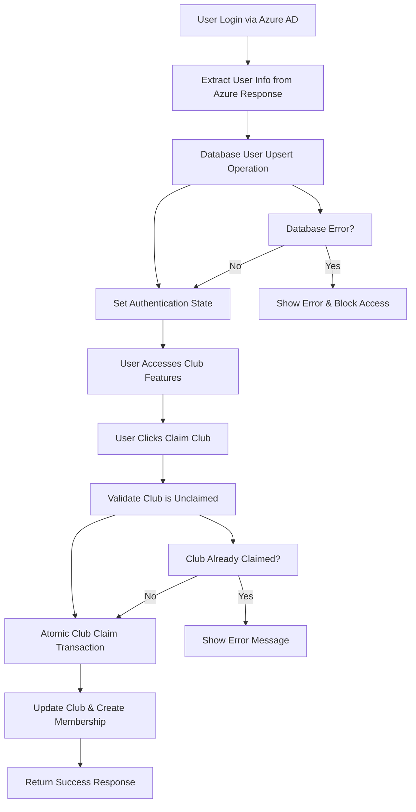

# Design Document

## Overview

This design restructures the user authentication and club claiming system to eliminate architectural complexity and provide a streamlined experience. The key changes include:

1. **Database-First User Management**: Eliminate localStorage dependency and make PostgreSQL the single source of truth for user data
2. **Atomic Authentication Flow**: Combine Azure AD authentication with immediate database user creation
3. **Simplified Club Claiming**: Reduce club claiming to a single database transaction
4. **Improved Error Handling**: Provide clear feedback and graceful failure recovery

## Architecture

### Current Architecture Issues

The existing system has several architectural problems:
- **Dual State Management**: User profiles stored in both localStorage and database, causing sync issues
- **Complex Authentication Flow**: Multi-step process with manual sync operations
- **Race Conditions**: Club claiming can fail due to concurrent access issues
- **Inconsistent Data**: localStorage and database can become out of sync

### New Architecture



## Components and Interfaces

### 1. Enhanced Authentication Service

**Purpose**: Handle Azure AD authentication and immediate database user registration

**Key Methods**:
- `authenticateAndRegister()`: Combined authentication and database registration
- `getUserFromDatabase()`: Retrieve user data from PostgreSQL
- `updateUserProfile()`: Update user information in database

**Interface**:
```typescript
interface AuthenticationService {
  authenticateAndRegister(azureResponse: AuthenticationResult): Promise<DatabaseUser>
  getUserFromDatabase(userId: string): Promise<DatabaseUser | null>
  updateUserProfile(userId: string, updates: Partial<UserProfile>): Promise<DatabaseUser>
}
```

### 2. Database User Repository

**Purpose**: Centralized database operations for user management

**Key Methods**:
- `upsertUser()`: Create or update user record atomically
- `findByEmail()`: Retrieve user by email address
- `findById()`: Retrieve user by ID

**Interface**:
```typescript
interface UserRepository {
  upsertUser(userData: UserData): Promise<DatabaseUser>
  findByEmail(email: string): Promise<DatabaseUser | null>
  findById(id: string): Promise<DatabaseUser | null>
}
```

### 3. Club Claiming Service

**Purpose**: Handle club claiming operations with proper concurrency control

**Key Methods**:
- `claimClub()`: Atomic club claiming operation
- `validateClaimEligibility()`: Check if club can be claimed
- `getClubWithLeadership()`: Retrieve club with current leadership info

**Interface**:
```typescript
interface ClubClaimingService {
  claimClub(clubId: string, userId: string): Promise<ClaimResult>
  validateClaimEligibility(clubId: string): Promise<boolean>
  getClubWithLeadership(clubId: string): Promise<ClubWithLeadership>
}
```

## Data Models

### Enhanced User Model

```typescript
interface DatabaseUser {
  id: string
  email: string
  name: string
  avatarUrl?: string
  role: 'student' | 'sponsor' | 'admin'
  grade?: string
  department?: string
  bio?: string
  createdAt: Date
  updatedAt: Date
}
```

### Club Claim Result Model

```typescript
interface ClaimResult {
  success: boolean
  message: string
  club?: {
    id: string
    name: string
    presidentId: string
  }
  error?: string
}
```

### Club with Leadership Model

```typescript
interface ClubWithLeadership {
  id: string
  name: string
  description: string
  category: string
  imageUrl?: string
  meetingTime?: string
  location?: string
  isClaimed: boolean
  president?: {
    id: string
    name: string
    email: string
    avatarUrl?: string
  }
  memberCount: number
}
```

## Error Handling

### Authentication Errors

1. **Azure AD Failure**: Display clear message and retry option
2. **Database Connection Error**: Show maintenance message and prevent access
3. **User Creation Failure**: Log error and provide support contact
4. **Email Domain Validation**: Clear message about Berkeley Prep requirement

### Club Claiming Errors

1. **Club Already Claimed**: Real-time validation with clear messaging
2. **Concurrent Claim Attempts**: Database-level constraints with user-friendly error
3. **User Not Found**: Automatic user sync with fallback error handling
4. **Database Transaction Failure**: Rollback with retry option

### Error Response Format

```typescript
interface ErrorResponse {
  success: false
  error: string
  code: string
  retryable: boolean
  supportContact?: string
}
```

## Testing Strategy

### Unit Tests

1. **Authentication Service Tests**
   - Azure AD response parsing
   - Database user upsert operations
   - Error handling scenarios

2. **User Repository Tests**
   - CRUD operations
   - Constraint validation
   - Concurrent access handling

3. **Club Claiming Service Tests**
   - Atomic transaction behavior
   - Concurrency control
   - Validation logic

### Integration Tests

1. **End-to-End Authentication Flow**
   - Azure AD login to database registration
   - Profile updates and persistence
   - Session management

2. **Club Claiming Flow**
   - Unclaimed club claiming
   - Already claimed club handling
   - Multiple user claim attempts

### Database Tests

1. **Constraint Validation**
   - Unique email enforcement
   - Foreign key relationships
   - Transaction rollback behavior

2. **Performance Tests**
   - Concurrent user registration
   - Bulk club claiming scenarios
   - Database connection pooling

## Implementation Phases

### Phase 1: Database-First User Management
- Remove localStorage dependency from auth context
- Implement database user repository
- Update authentication flow to use database as source of truth

### Phase 2: Atomic Authentication
- Combine Azure AD authentication with database registration
- Implement proper error handling and rollback
- Add user profile update capabilities

### Phase 3: Simplified Club Claiming
- Implement atomic club claiming service
- Add concurrency control and validation
- Update UI to reflect real-time claim status

### Phase 4: Enhanced Error Handling
- Implement comprehensive error responses
- Add retry mechanisms for transient failures
- Improve user feedback and support options

## Security Considerations

### Authentication Security
- Validate Azure AD tokens properly
- Enforce Berkeley Prep email domain restrictions
- Implement session timeout and refresh

### Database Security
- Use parameterized queries to prevent SQL injection
- Implement proper access controls and permissions
- Log all user registration and club claiming activities

### Concurrency Security
- Use database-level constraints to prevent race conditions
- Implement proper transaction isolation levels
- Handle deadlock scenarios gracefully

## Performance Considerations

### Database Optimization
- Index frequently queried fields (email, club_id, user_id)
- Use connection pooling for database access
- Implement query timeout and retry logic

### Caching Strategy
- Cache user profile data in memory for session duration
- Implement club data caching with invalidation
- Use Redis for distributed caching if needed

### Monitoring and Metrics
- Track authentication success/failure rates
- Monitor club claiming operation performance
- Alert on database connection issues or high error rates